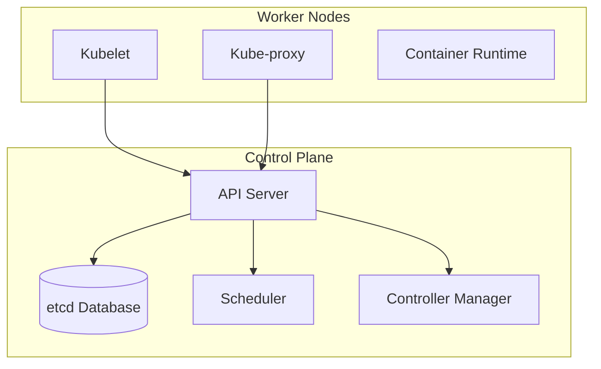

# Kubernetes (K8s) Guide & Reference

Kubernetes is an open-source container orchestration platform designed to automate deploying, scaling, and managing containerized applications.

---

## 1. Kubernetes Architecture

A Kubernetes cluster consists of a **Control Plane** (which manages the cluster) and one or more **Worker Nodes** (which run the application containers).



### Control Plane Components
*   **kube-apiserver:** The entrypoint for all administrative tasks. It exposes the Kubernetes API.
*   **etcd:** A highly-available, distributed key-value store used to hold all cluster state and configuration data.
*   **kube-scheduler:** Watches for newly created Pods with no assigned node, and selects a node for them to run on based on resource requirements, policy constraints, etc.
*   **kube-controller-manager:** Runs controller processes that watch the state of the cluster and make changes attempting to move the current state towards the desired state (e.g., node controller, job controller).

### Node Components
*   **kubelet:** An agent that runs on each node in the cluster. It ensures that containers are running in a Pod according to the PodSpec.
*   **kube-proxy:** A network proxy that runs on each node, maintaining network rules to allow network communication to Pods from inside or outside the cluster.
*   **Container Runtime:** The software responsible for running containers (e.g., `containerd`, Docker Engine).

---

## 2. Core Kubernetes Objects

*   **Pod:** The smallest deployable unit in Kubernetes. A Pod represents a single instance of a running process and can contain one or more tightly coupled containers.
*   **Deployment:** Provides declarative updates for Pods and ReplicaSets. It manages running multiple replicas of a Pod, handles rolling updates, and rolls back to previous versions if needed.
*   **Service:** An abstract way to expose an application running on a set of Pods as a network service. Types include:
    *   `ClusterIP` (default): Exposes the service on a cluster-internal IP.
    *   `NodePort`: Exposes the service on each Node's IP at a static port.
    *   `LoadBalancer`: Exposes the service externally using a cloud provider's load balancer.
*   **Namespace:** A virtual cluster partition used to isolate resources (e.g., `dev`, `staging`, `production`).
*   **ConfigMap / Secret:** Used to separate configuration artifacts (ConfigMap) or sensitive information (Secret) from image content to keep containerized applications portable.

---

## 3. Essential kubectl Commands

### Cluster Management
*   `kubectl cluster-info` — Display cluster info.
*   `kubectl get nodes` — List all nodes in the cluster.
*   `kubectl get namespaces` — List namespaces.

### Resource CRUD (Create, Read, Update, Delete)
*   `kubectl apply -f <filename.yaml>` — Create or update resources defined in a YAML file.
*   `kubectl get <resource_type>` — List resources (e.g., `kubectl get pods`, `kubectl get deployments`, `kubectl get services`).
*   `kubectl describe <resource_type> <resource_name>` — Show detailed state of a resource.
*   `kubectl delete -f <filename.yaml>` — Delete resources defined in a YAML file.
*   `kubectl delete <resource_type> <resource_name>` — Delete a resource by type and name.

### Debugging & Troubleshooting
*   `kubectl logs <pod_name>` — Print logs for a Pod.
*   `kubectl logs -f <pod_name>` — Stream logs for a Pod.
*   `kubectl exec -it <pod_name> -- <command>` — Execute an interactive command inside a container (e.g., `kubectl exec -it my-pod -- sh`).
*   `kubectl port-forward <pod_or_service_name> <local_port>:<target_port>` — Forward a local port to a port on a Pod or Service.

---

## 4. Sample Manifest Files

### Simple Deployment Manifest (`deployment.yaml`)
```yaml
apiVersion: apps/v1
kind: Deployment
metadata:
  name: bun-web-deployment
  labels:
    app: bun-web
spec:
  replicas: 3
  selector:
    matchLabels:
      app: bun-web
  template:
    metadata:
      labels:
        app: bun-web
    spec:
      containers:
      - name: bun-web-app
        image: oven/bun:1.1-alpine
        ports:
        - containerPort: 3000
        resources:
          limits:
            cpu: "500m"
            memory: "256Mi"
          requests:
            cpu: "250m"
            memory: "128Mi"
```

### Simple Service Manifest (`service.yaml`)
```yaml
apiVersion: v1
kind: Service
metadata:
  name: bun-web-service
spec:
  selector:
    app: bun-web
  ports:
    - protocol: TCP
      port: 80
      targetPort: 3000
  type: ClusterIP
```
